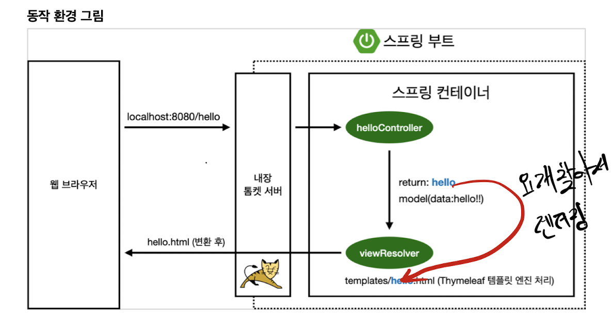

# Welcome Page

## 정적 페이지

스프링 부트 기반으로 웹 서버를 실행 후 `localhost:8080` 로 접속을 하면, 

기본적으로 IntelliJ에서 `src/main/resources/static/index.html` 을 찾아 띄워준다. 

이름이 `index.html`인 파일을 찾아서 자동으로 보여주며, 이를 welcome page 기능이라 한다. 

- 먼저 index.html static 파일을 찾고, 없다면
- index 이름을 가진 template 파일을 찾는다.

이때,  `index.html` 파일은 `static` 디렉토리에 위치한 만큼, 그냥 정적 페이지일 뿐이다. 

## Controller

코드를 보면서 설명하겠다.

```java
// 출처: 강의 교안
1 @Controller
2  public class HelloController {
3      @GetMapping("hello")
4      public String hello(Model model) {
5          model.addAttribute("data", "hello!!");
6          return "hello";
7      }
8 }
```

- 1번 라인: annotation
- 3번 라인
    - HTTP 통신에서의 Get이나 Post 같은 메소드를 딴거다. 여기서는 페이지를 띄우는것만 할거니까 Get 사용.
    - hello 라는 입력이 들어오면 아래 메소드 실행!
- 5번 라인: "data"와 "hello!!"는 key, value 쌍이다.
- 6번 라인: hello를 반환하는 것은 template 중에서 hello 이름을 가지는 페이지를 보여주겠다는 소리.

```java
// 출처: 강의 교안
// 이 파일은 resources/templates/hello.html 에 위치
1 <html xmlns:th="http://www.thymeleaf.org">
2   <head>
3       <title>Hello</title>
4       <meta http-equiv="Content-Type" content="text/html; charset=UTF-8" />
5   </head>
6 <body>
7 <p th:text="'안녕하세요. ' + ${data}" >안녕하세요. 손님</p>
8   </body>
9   </html>
```

- 7번 라인
    - `${data}` : controller 코드 부분의 key, value 쌍에 의해 "hello!!" 문자열로 치환되어 보여진다.
    - "안녕하세요. 손님" 이란 문자열은 그냥 로컬에서 보면, 즉 치환할 문자열이 안주어지면 나오는 텍스트다.

## 작동 원리

- 일단 위에서 본 `HelloController`를 실행하려면 `localhost:8080/hello`에 접속해야한다.

> 출처: 강의 교안
- 기본적으로 스프링 부트는 톰캣 웹서버를 내장하고 있다.
- 브라우저에서 `hello`라는 요청을 보내면, 톰캣에서 `helloController`를 실행한다.
    - `GetMapping("hello")`라는 annotation이 있으므로.
- 컨트롤러에서는
    - data라는 key에 hello라는 value를 가지고,
    - hello라는 문자열을 반환한다. hello 이름을 가진 뷰를 실행하겠다는 의미.
- viewResolver는 hello 문자열을 받아 템플릿 디렉토리 내에 hello라는 이름을 가진 파일이 있는지 찾아본다.
    - `resources:template/` + [view이름. 즉 반환된 문자열] + `.html`
- 마지막으로 해당 html 파일을 렌더링하여 브라우저에게 반환한다.

# 배포 및 실행하기

지금까지의 모든 과정은 IntelliJ를 이용한 웹서버 구동이었다. 

스프링이 진짜 강력한 이유는, 스냅샷을 옮기기만 하면 CLI에서 한줄의 명령어로도 웹서버 구동이 가능하다는 점이다. 

1) 작업하고 있는 폴더로 들어간다 (start.spring.io에서 다운 받은 폴더)

2) `./gradlew build`로 빌드하고, `cd build/libs`로 이동. 

3) `java -jar hello-spring-0.0.1-SNAPSHOT.jar` 실행 시 아래와 같이 웹 서버가 구동된다. 

즉, 인텔리제이에서 하는거 말고도 이런식으로 jar 파일만 서버에 넣어서 실행하면 배포가 가능해진다!!!

```bash
kyungmin@kyungminny libs % java -jar hello-spring-0.0.1-SNAPSHOT.jar 

  .   ____          _            __ _ _
 /\\ / ___'_ __ _ _(_)_ __  __ _ \ \ \ \
( ( )\___ | '_ | '_| | '_ \/ _` | \ \ \ \
 \\/  ___)| |_)| | | | | || (_| |  ) ) ) )
  '  |____| .__|_| |_|_| |_\__, | / / / /
 =========|_|==============|___/=/_/_/_/
 :: Spring Boot ::                (v2.5.1)

2021-06-17 14:48:57.598  INFO 49517 --- [           main] h.hellospring.HelloSpringApplication     : Starting HelloSpringApplication using Java 12 on kyungminny.local with PID 49517 (/Users/kyungmin/Desktop/study/spring/hello-spring/build/libs/hello-spring-0.0.1-SNAPSHOT.jar started by kyungmin in /Users/kyungmin/Desktop/study/spring/hello-spring/build/libs)
2021-06-17 14:48:57.601  INFO 49517 --- [           main] h.hellospring.HelloSpringApplication     : No active profile set, falling back to default profiles: default
2021-06-17 14:48:58.982  INFO 49517 --- [           main] o.s.b.w.embedded.tomcat.TomcatWebServer  : Tomcat initialized with port(s): 8080 (http)
2021-06-17 14:48:58.996  INFO 49517 --- [           main] o.apache.catalina.core.StandardService   : Starting service [Tomcat]
2021-06-17 14:48:58.996  INFO 49517 --- [           main] org.apache.catalina.core.StandardEngine  : Starting Servlet engine: [Apache Tomcat/9.0.46]
2021-06-17 14:48:59.067  INFO 49517 --- [           main] o.a.c.c.C.[Tomcat].[localhost].[/]       : Initializing Spring embedded WebApplicationContext
2021-06-17 14:48:59.067  INFO 49517 --- [           main] w.s.c.ServletWebServerApplicationContext : Root WebApplicationContext: initialization completed in 1407 ms
2021-06-17 14:48:59.307  INFO 49517 --- [           main] o.s.b.a.w.s.WelcomePageHandlerMapping    : Adding welcome page: class path resource [static/index.html]
2021-06-17 14:48:59.423  INFO 49517 --- [           main] o.s.b.w.embedded.tomcat.TomcatWebServer  : Tomcat started on port(s): 8080 (http) with context path ''
2021-06-17 14:48:59.433  INFO 49517 --- [           main] h.hellospring.HelloSpringApplication     : Started HelloSpringApplication in 2.289 seconds (JVM running for 2.756)
2021-06-17 14:49:15.147  INFO 49517 --- [nio-8080-exec-1] o.a.c.c.C.[Tomcat].[localhost].[/]       : Initializing Spring DispatcherServlet 'dispatcherServlet'
2021-06-17 14:49:15.148  INFO 49517 --- [nio-8080-exec-1] o.s.web.servlet.DispatcherServlet        : Initializing Servlet 'dispatcherServlet'
2021-06-17 14:49:15.149  INFO 49517 --- [nio-8080-exec-1] o.s.web.servlet.DispatcherServlet        : Completed initialization in 1 ms
2021-06-17 14:49:15.314 ERROR 49517 --- [nio-8080-exec-1] org.thymeleaf.TemplateEngine             : [THYMELEAF][http-nio-8080-exec-1] Exception processing template "index ": Error resolving template [index ], template might not exist or might not be accessible by any of the configured Template Resolvers
```
